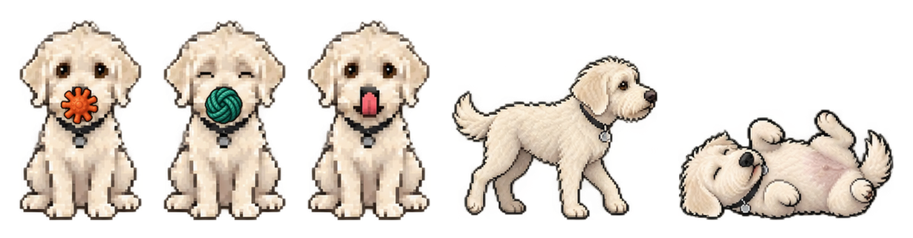
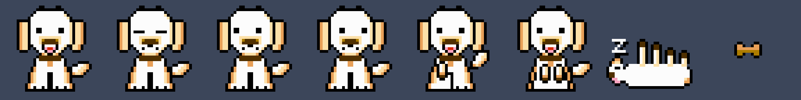

# Pikselhund

En pikselhund som sitter på skrivebordet og logrer, og som holder leka til den
av Claude og ChatGPT du har mest kvote igjen på. Native macOS-app, bygget med
`swiftc` uten Xcode-prosjekt.

Den finnes i to tegninger, og «Ny tegning» i menyen bytter mellom dem:





## Bygg og kjør

```bash
./build.sh && open build/Pikselhund.app
```

Appen har ikke ikon i Dock. Den bor i menylinja, under labben.

## Hvem du bør bruke

Hunden holder en leke i munnen. **Oransje ball med stjerne er Claude, grønn
ring er ChatGPT.** Leka er den av dem du har mest kvote igjen på, målt som det
verste av femtimersvinduet og uka hos hver. Menylinja sier det samme i tekst,
for eksempel `ChatGPT 11 %`, og menyen under labben har begge, med tid til
nullstilling og hvor gamle tallene er.

Skifter svaret, snurrer hunden en runde og sitter igjen med den andre leka. Den
bytter ikke for mindre enn 8 poengs forskjell, ellers ville den skiftet hver
gang tallene rikket seg. Er begge over 90 prosent, bærer den ingenting og
legger seg.

**Den tigger når et vindu åpner seg.** Ruller et vindu som var trangt rundt,
tigger den tre ganger med et minutts mellomrom og holder leka til den det
gjelder. Sover den, våkner den. En rulling kjennes igjen på to ting samtidig:
nullstillingen har flyttet seg minst et halvt vindu framover, og prosenten har
falt minst 15 poeng fra minst 40. Hver for seg gir de falske utslag.

Tallene kommer fra `forbruksvakt.py`, som hunden kjører selv hvert 150.
sekund, og som leser Codex sine øktfiler og Claude sine transkripsjoner på
maskinen. **Det skriptet er ikke offentlig.** Uten det bærer hunden ingen leke,
og menyen sier «Kvote: ukjent». Resten virker som før.

## Hva hunden gjør

Logrer, blunker, peser og puster av seg selv. Klikk på den, så hopper den og
får hjerter over hodet. Dra den dit du vil ha den, posisjonen huskes.

**Følger musepekeren.** Øynene flytter seg mot pekeren, og kommer den helt
inntil, dytter hunden snuten mot den. Pekerposisjonen leses av klokka, ikke av
en hendelseslytter, så appen trenger ingen tilgang å be om.

**Maser med poten.** Med noen minutters mellomrom løfter den den ene poten og
dulter borti deg. Klapper du den, nullstilles masetimeren.

**Tigger.** Setter seg opp med begge poter hengende. Skjer av seg selv
innimellom, og oftere mellom elleve og ett og mellom fire og seks, som er når
hunder flest mener det er mat.

**Sover.** Etter halvannet minutt uten mus eller tastatur legger den seg på
ryggen med potene rett opp og z-er over hodet. Kommer musepekeren nærmere enn
210 punkter mens den sover, kommer pekeren med en godbit, og hunden strekker
seg og våkner.

**Slikker seg om munnen.** Tunga opp over nesa, tre svip.

**Snurrer en runde.** Veksler mellom forfra og bakfra, som når den vil ut.

**Går en tur.** Reiser seg, går i profil bortover skjermkanten, snuser der
borte, og kommer tilbake dit den sto. Å ta tak i den avbryter turen.

**Henter ballen.** Kommer med en ball i munnen, legger den fra seg foran deg,
og venter. Klikker du på hunden mens ballen ligger der, henter den den igjen.

**Henter en kastet ball.** «Kast ballen…» i menyen gir et sikte over hele
skjermen. Klikk der ballen skal lande, så løper hunden dit, hopper opp på
vinduene som er i veien, går bortover toppen av dem, og kommer tilbake med
ballen. Den ligger **bak** vinduene når den løper på skrivebordsgulvet og
**foran** når den står oppå et vindu, så den kommer seg mellom, over og under
dem. Ta tak i den for å avbryte.

**Går og legger seg i hundehuset.** «Send den i hundehuset» setter opp et
hundehus, hunden går bort til det, forsvinner inn, og appen avslutter.

**Tar en leikebukk.** Framparten ned, bakparten i været.

**Ruller over på ryggen.** To klapp tett etter hverandre, så legger den seg
på ryggen og vrikker for magekos.

**«Reduser bevegelse».** Er den skrudd på i systeminnstillingene, sitter hunden
helt stille med tunga inne. Den forsvinner ikke, den slutter bare å røre seg.

Høyreklikk gir samme meny som labben i menylinja: be den tigge, be om
poteklapp, legge seg, størrelse, foran eller bak vinduene, speilvending, klikk
gjennom, og start ved pålogging.

«La klikk gå gjennom hunden» gjør den til ren dekorasjon. Da svarer den ikke
på høyreklikk heller, og menylinja er eneste vei tilbake.

## Tegningen

All grafikk ligger i `Art/pikselhund.txt` som ASCII, ett tegn per piksel.
Fila er fasit: både appen og forhåndsvisningsverktøyet leser den samme fila.
Paletten er hentet fra NES-paletten.

Rammene legges oppå hverandre, og `.` slipper laget under gjennom. Nederst
ligger `kropp`, eller `tigger` når den tigger, eller `sover` når den sover.
Oppå det kommer en av `hale-ned` / `hale-midt` / `hale-opp`, og så `pote-opp`,
`blunk`, `tunge` og `blikk-venstre` / `blikk-hoyre` etter behov. `hjerte`,
`zzz` og `godbit` tegnes for seg.

`tigger` og `sover` er **hele rammer**, ikke overlegg, fordi de endrer
silhuetten og et overlegg bare kan legge til piksler. Endrer du `kropp`
nedentil, må `tigger` etter. Alt annet er overlegg og følger med av seg selv.

**Krem på hvitt har nesten ingen kontrast.** En pote tegnet i `w` mot en kropp
i `W` forsvinner, og bare det svarte omrisset leser. Derfor har alle poter en
mørk pute i `N` nederst. Det er det eneste som gjør at de leser som poter.

Endre tegningen, se resultatet, bygg på nytt:

```bash
python3 tools/forhandsvis.py && open forhandsvisning.png
```

Rammene må være like store, ellers nekter appen å starte og sier hvilken ramme
som er skjev. `build.sh` sjekker det samme **før** den kompilerer, så en skjev
ramme stopper bygget i stedet for å gi en app som ikke starter.

For å fotografere en enkelt positur uten å vente på at den skal skje:

```bash
open build/Pikselhund.app --args --vis tigger
```

`--vis` tar `sitter`, `tigger`, `sover`, `mage`, `snurrer`, `bukker`, `ball`
eller `gaar`, og låser hunden der. `--vis tur`, `--vis vekking`, `--vis sikte`,
`--vis hus`, `--vis godbit` og `--vis kast:X,Y` låser ikke, de setter i gang
den ekte bevegelsen så den kan fotograferes. `--spor` skriver posisjon,
plattform og mål til stdout hvert kvarte sekund, som er eneste praktiske måte
å feilsøke hoppingen på.

**Tellere som ruller hver ramme må ligge i animasjonen, ikke i
tilstandsstyringen.** Låsen i `--vis` skrur av tilstandsstyringen, så en teller
som ligger der stopper, og posituren ser død ut. Feilen er gjort tre ganger i
dette prosjektet: poteklapp, z-er og gangrammer.

## Den nye tegningen

Tegnet på nytt av ChatGPT i september 2026, som hele figurer i stedet for
lag. Arkene ligger i `Art/kilde/`, og `tools/klipp-sprites.py` klipper dem til
enkeltfigurer i `Art/sprites/`. Bygget gjør det selv, og trenger da Pillow.
Mangler Pillow, bygges appen uten den nye tegningen, og menyvalget er grått.

```bash
python3 tools/klipp-sprites.py && open Art/sprites/oversikt.png
```

Alle figurene ligger på samme kvadratiske lerret, forankret nederst og
midtstilt, så de tegnes i nøyaktig samme rute som 32x32-rammene. Der de svarer
til hverandre, heter de det samme som de gamle rammene.

**De røde og gule pikslene rundt figurene i arkene er ikke en frans.** De
ligger der alfa er null, og synes bare i visninger som ignorerer alfa.

**Den sittende hunden er bygget av lag**, slik 32x32-hunden er. En bildemodell
tegner hver rute på nytt, så pelsen er litt ulik fra ramme til ramme, og å bla
gjennom hele rammer får hunden til å skjelve. Derfor tas kroppen fra en ramme,
og øyne, munn og leke hentes fra de andre gjennom masken i
`Art/kilde/sitte-ansikt-maske.png`. Den ble laget av hvor rammene varierer
mest.

**Den nye tegningen er roligere med vilje.** Samme tomgangsanimasjon som gir liv
til 32 ruter gir uro til en detaljert figur. Halen logrer derfor i korte drag,
pusten er ett punkt, og søvnen ligger stille.

**Den sittende hunden er i en annen stil enn resten**, rundere og gulere. Det
synes når den reiser seg.

## Feilsøking

`--spor` teller også hvor mange ganger i sekundet det hunden viser endrer seg,
fordi stillhet ikke kan fotograferes. `--foto <fil>` skriver det appen faktisk
tegner til en PNG etter tre sekunder, også når skjermen sover:

```bash
./build/Pikselhund.app/Contents/MacOS/Pikselhund --vis sitter --foto /tmp/hund.png
```

## Ikonet

```bash
python3 tools/lag-ikon.py
```

Lager `AppIcon.icns` av hunden selv mot Super Mario Bros.-himmel. `build.sh`
kopierer det inn hvis det finnes.

## Filer

| fil | hva |
|---|---|
| `Art/pikselhund.txt` | 32x32-tegningen, 28 rammer |
| `Art/kilde/` | arkene til den nye tegningen, og hva hver rute heter |
| `Sources/Piksler.swift` | leser begge tegningene, lager bilder |
| `Sources/Kvote.swift` | kvota fra forbruksvakt, hvem som anbefales |
| `Sources/Hund.swift` | vindu, animasjon, mus, innstillinger |
| `Sources/Leker.swift` | vinduer som plattformer, ball, sikte, hundehus |
| `Sources/App.swift` | menylinje og meny |
| `tools/forhandsvis.py` | rammene som PNG |
| `tools/lag-ikon.py` | app-ikonet |
| `tools/klipp-sprites.py` | klipper arkene til figurer og lag |
